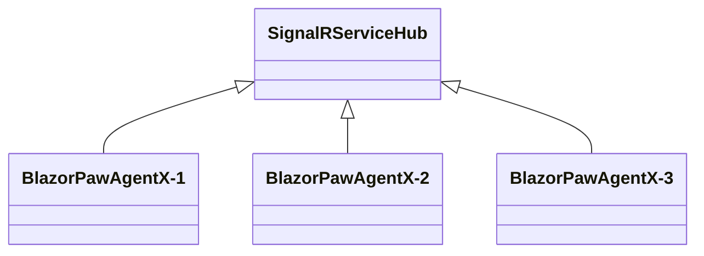

# Summary

Agent-X is an outdoor game that requires at least 2 players. The first player is Agent-X and all other players are police officers that try to catch Agent-X. All player see a map showing where the all the players are. The position of police officers is updated in real time, but the position of Agent-X is updated only every 60 seconds.

Agent-X is a [Blazor Progressive Web Application (PAW)](https://learn.microsoft.com/en-us/aspnet/core/blazor/progressive-web-app) written in C# (.NET). PAW have the benefit that they can run in the browser, but can also be installed as Native Application on any mobile or PC. 

To communicate between 2 applications running on a mobile phone, a WebServer is required, since direct communication is not possible. [BlazorPawAgentX](https://github.com/feifel/BlazorPawAgentX/tree/main) is using [SignalRServiceHub](https://github.com/feifel/SignalRServiceHub) for this:

# Project creation tutorial

This sections describes how this  project was created. In case you want to build something similar, this could be a good starting point. 

1. Download Visual Studio 2022 Community Edition
2. When install Visual Studio, make sure that you select “ASP.NET and web development”
3. Open “developer command prompt” by typing this to the Windows Search bar
4. Create a directory for your source code repositories: `mkdir userprofile%\source\repos`
5. Change to this directory: `cd %userprofile%\source\repos`
6. Create an empty web project: `dotnet new blazorwasm -o BlazorPawAgentX --pwa` 
7. Change the directory to the project folder: `cd BlazorPawAgentX` 
8. In order to use [Git](https://git-scm.com/) to track your changes in the project:
    1. Install Git: `winget install --id Git.Git -e --source winget`
    2. Restart the “developer command prompt” and change to the current directory again
    3. Configure git:
        
        `git config --global user.email "[you@example.com](mailto:you@example.com)"`
        
        `git config --global [user.name](http://user.name/) "Your Name"`
        
    4. Initialize Git: `git init`
    5. Create a .gitignore: `dotnet new gitignore`
    6. Add files to Staging area: `git add .`
    7. Commit the changes: 
    `git commit -m "Project created with: dotnet new blazorwasm -o BlazorPawAgentX --pws"`
9. Before we do apply further changes I push it to GitHub:
    1. Create a free account on github for free by using the “Sign up” on [https://github.com/](https://github.com/)
    2. Create a new repository “SignalRServiceHub" on github. **NOTE: To pervent merge conflict, it is very important to NOT initialize it with a README, .gitignore, or license.**
    3. Add the project to the remote repo in the “developer command prompt” with:
    `git remote add origin <your-repository-URL>`
    4. The remote branch is main, the local is master, so we need to: `git branch -M main`
    5. Push the local changes to GitHub: `git push -u origin main`
10. Build the project: `dotnet build`
11. Open the project in Visual Studio: `devenv BlazorPawAgentX.csproj`
12. You can start the App by pressing the green play button (https). This opens a browser and shows a sample app, that we will modify in the following steps.
13. Modify the sample App like you can see in [this](https://github.com/feifel/BlazorPawAgentX/commit/1c6ee5aebd7470c902814f12572b5519259a2fe0) commit.
14. In order to test it, we need to start the [SignalRServiceHub](https://github.com/feifel/SignalRServiceHub).
15. The URL of the SignalRServiceHub need to be configured [here](https://github.com/feifel/BlazorPawAgentX/blob/1c6ee5aebd7470c902814f12572b5519259a2fe0/App.razor#L15).
16. When you now press the green play button (https) in Visual Studio again, you can test the initial version of the Agent-X App.